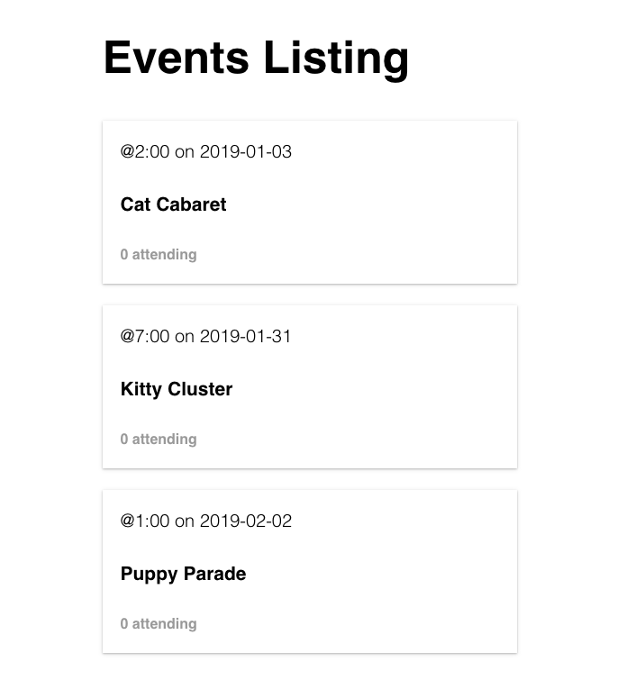
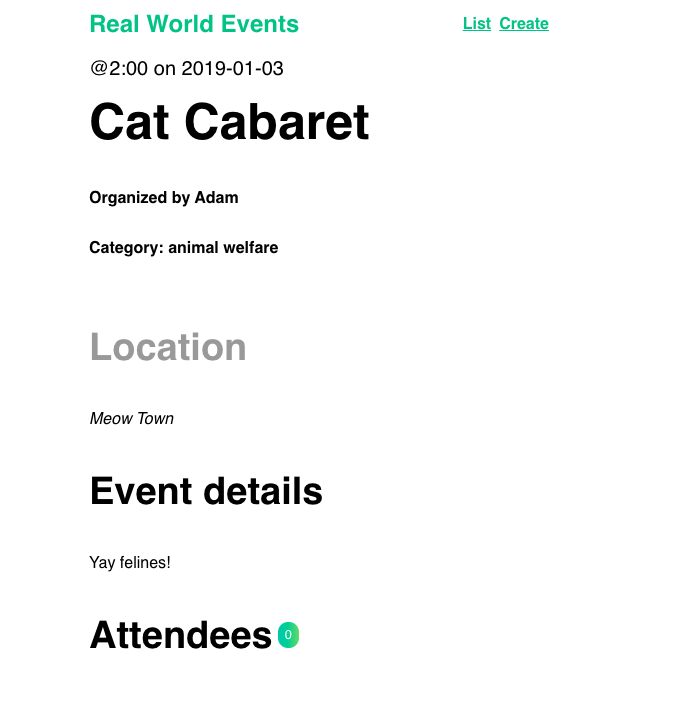

# Event List App

This app displays a list of upcoming events and allows the user to click on an individual event to see specific details.

Initial events are retreived through an Axios GET request to the localhost using the json-server package utilizing the db.json file

To view the app, install json-server, then run json-server --watch db.json

# List of Events

# Event Preview Image

